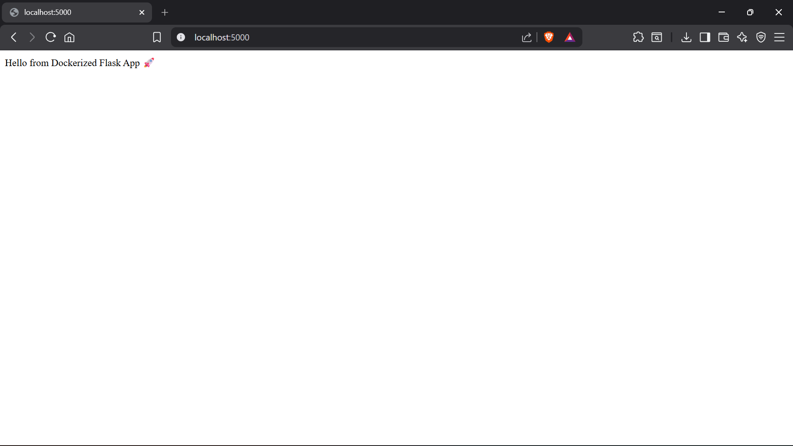
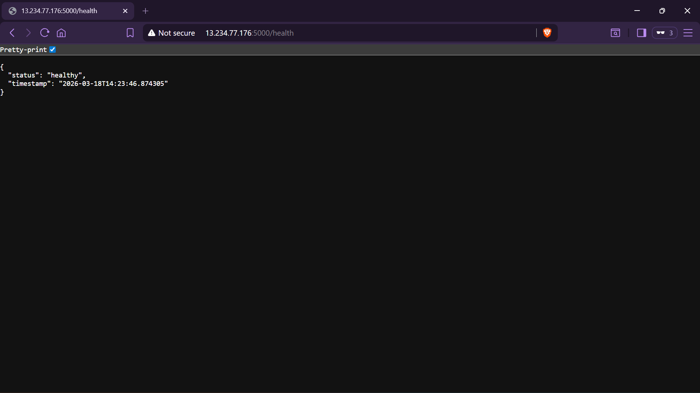
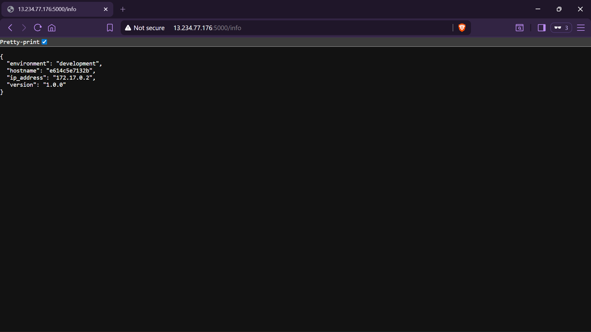
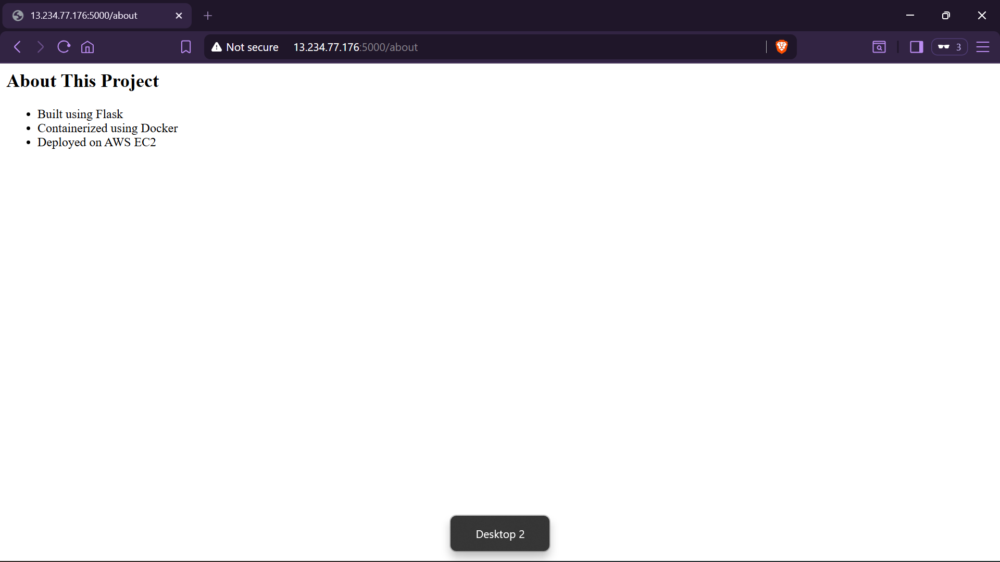
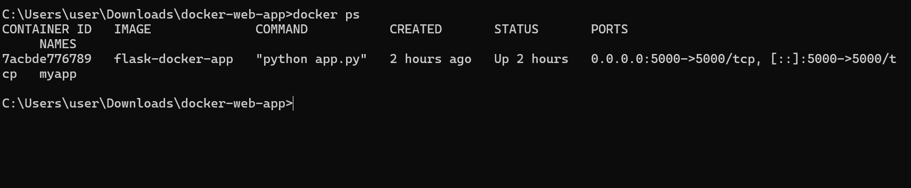
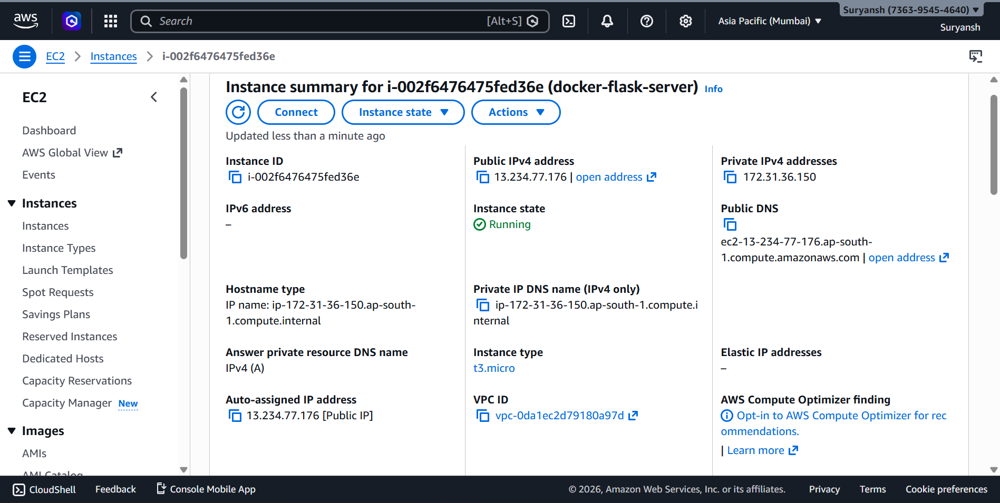
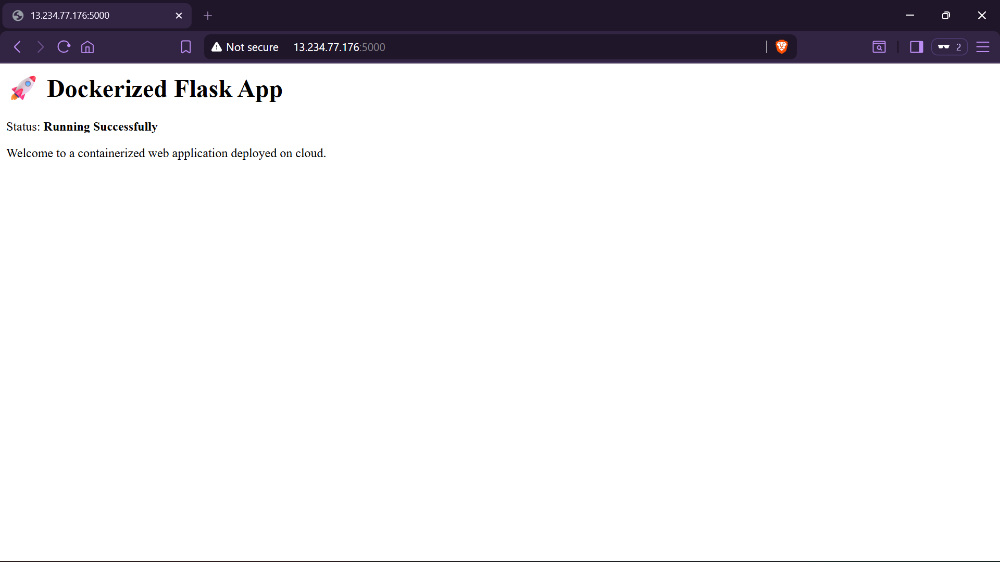
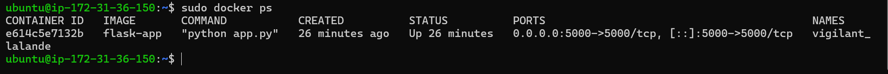

# 🚀 Dockerized Flask Web App on AWS EC2

## 📌 Project Overview

This project showcases how to build, containerize, and deploy a Python Flask web application on the cloud. The application exposes multiple endpoints, including health checks and system information, mimicking real-world backend services.

---

## 🚀 Live Demo

👉 http://13.234.77.176:5000

---

## 🛠️ Tech Stack

* **Backend:** Python (Flask)
* **Containerization:** Docker
* **Cloud Platform:** AWS EC2 (Ubuntu)
* **Version Control:** GitHub

---

## ✨ Features

* Multi-route Flask application
* REST-style API endpoints
* Docker containerization
* Cloud deployment on AWS EC2
* Publicly accessible live application

---

## 📂 Project Structure

```
docker-web-app/
│
├── app.py
├── requirements.txt
├── Dockerfile
├── README.md
│
└── screenshots/
    ├── 01-local-app.png
    ├── 02-health.png
    ├── 03-info.png
    ├── 04-about.png
    ├── 05-docker-local.png
    ├── 06-ec2-dashboard.png
    ├── 07-live-app.png
    └── 08-docker-ec2.png
```

---

## 🚀 Application Endpoints

| Endpoint  | Description                  |
| --------- | ---------------------------- |
| `/`       | Home page                    |
| `/health` | Health check API             |
| `/info`   | System & environment details |
| `/about`  | Project information          |

---

## ⚙️ How to Run Locally

### 1. Clone the repository

```
git clone https://github.com/your-username/docker-web-app.git
cd docker-web-app
```

### 2. Build Docker image

```
docker build -t flask-docker-app .
```

### 3. Run container

```
docker run -d -p 5000:5000 flask-docker-app
```

### 4. Open in browser

```
http://localhost:5000
```

---

## ☁️ Deployment on AWS EC2

### Steps followed:

1. Launched EC2 instance (Ubuntu)
2. Installed Docker on EC2
3. Transferred project files to server
4. Built Docker image on EC2
5. Ran container with port 5000 exposed
6. Accessed application via public IP

---

## 📸 Screenshots

### 🖥️ Local Application



### 🧪 Health Endpoint



### 📊 Info Endpoint



### 📘 About Page



### 🐳 Docker (Local)



### ☁️ AWS EC2 Dashboard



### 🌍 Live Application (EC2)



### 🐳 Docker on EC2



---

## 🧠 Key Learnings

* Docker container lifecycle management
* Building and running containerized applications
* Cloud deployment using AWS EC2
* Linux server handling via SSH
* Exposing applications over public IP

---

## 🚀 Future Improvements

* Add Nginx reverse proxy
* Implement CI/CD pipeline (GitHub Actions)
* Use Docker Compose for multi-container setup
* Add custom domain with HTTPS

---

## 👨‍💻 Author

Developed as part of a cloud computing and DevOps learning project.

---
